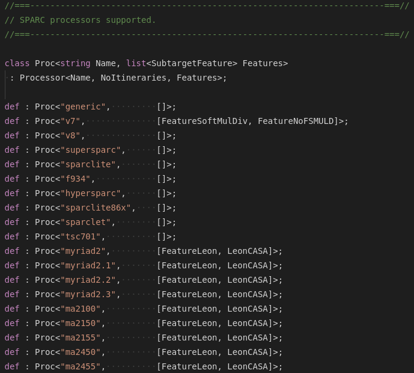

# LLVM TableGen

Simple syntax highlighting support for the LLVM TableGen language.

TextMate grammar used was taken from the official [LLVM repository](https://github.com/llvm-mirror/llvm/blob/master/utils/textmate/TableGen.tmbundle/Syntaxes/TableGen.tmLanguage).

## Features

- Syntax highlighting

## Known Issues

- Please report any issues or suggestions you find on [GitHub](https://github.com/jakoberzar/vscode-llvm-tablegen/issues).